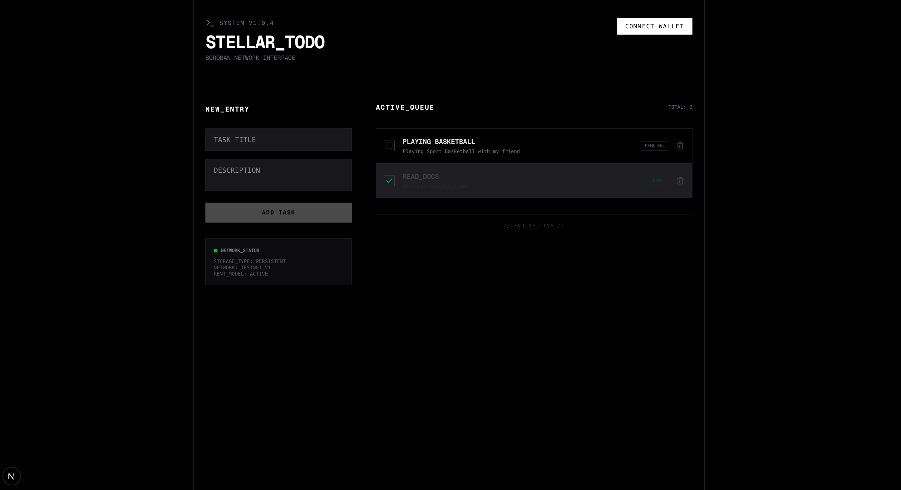

# 🚀 Stellar Todo DApp (Soroban Submission)

Halo aku sayyidusy syauqi al ghiffari! Ini  project **Decentralized Application (dApp)** berbasis **Stellar** yang saya bangun sebagai tugas submission setelah mengikuti Stellar Workshop. Aplikasi ini bukan sekadar *to-do list* biasa, melainkan implementasi dari teknologi blockchain khususnya di ekosistem Smart Contract milik Stellar, yaitu **Soroban**.

---

## 📸 Preview Aplikasi


*Tampilan antarmuka (UI) menggunakan Next.js*

---

## 🛠 Apa yang Spesial dari Project Ini?

Dalam project ini, saya mengintegrasikan beberapa konsep utama dari ekosistem Web3 dan Blockchain:

### 1. Soroban Smart Contract
Logika utama aplikasi ini (seperti menambah atau menghapus tugas) tidak berjalan di server database konvensional, melainkan di dalam **Smart Contract** yang dibangun di atas **Soroban** (platform smart contract Stellar). Data tugas disimpan dalam *persistent storage* di jaringan Stellar.

### 2. Mengapa Menggunakan Rust?
Smart contract ini ditulis menggunakan bahasa **Rust**. Kenapa Rust? 
- **Keamanan:** Mencegah banyak bug memori yang umum terjadi.
- **Efisiensi:** Dikompilasi menjadi WebAssembly (WASM) yang sangat ringan dan cepat saat dieksekusi di blockchain.

### 3. Konsep Web3 & Blockchain
- **Desentralisasi:** Data tugas tidak dikontrol oleh satu entitas pusat, melainkan terdistribusi di ledger Stellar.
- **Wallet Connection:** Aplikasi ini dirancang untuk nantinya terhubung dengan **Freighter Wallet** sebagai identitas pengguna (True Wallet/Self-custody).
- **On-chain Action:** Saat kita menambah tugas, kita sebenarnya mengirim transaksi yang akan divalidasi oleh network.

---

## 🏗 Struktur Project

Project ini terbagi menjadi dua bagian utama:
1.  **/contracts**: Berisi kode smart contract (Rust) yang mengelola logika CRUD (Create, Read, Update, Delete) tugas di blockchain.
2.  **/frontend**: Antarmuka pengguna yang dibangun dengan **Next.js** dan **Tailwind CSS**. UI dirancang minimalis agar fokus pada fungsi dan performa teknis.

---

## 🚀 Cara Menjalankan Project

### Prerequisites
- Rust & Cargo
- Target `wasm32-unknown-unknown`
- Node.js & npm
- Stellar CLI (untuk deploy contract)

### 1. Menjalankan Smart Contract (Backend)
Masuk ke folder kontrak dan jalankan pengujian untuk memastikan logika benar:
```bash
cd contracts/todo
cargo test
```

### 2. Menjalankan Frontend
Masuk ke folder frontend dan jalankan server lokal:
```bash
cd frontend
npm install
npm run dev
```
Akses di `http://localhost:3000`.

---

## 📝 Catatan Tambahan
Project ini dibuat dengan fokus pada kejelasan kode dan pemahaman alur data dari Smart Contract ke Frontend. Tampilan UI sengaja dibuat tajam (*sharp edges*) dan minimalis untuk memberikan kesan profesional dan berfokus pada utilitas sistem.

---
**Submission Oleh:** [Nama Kamu]
*Dibuat untuk tugas workshop pengembangan dApp Stellar/Soroban 2026.*
